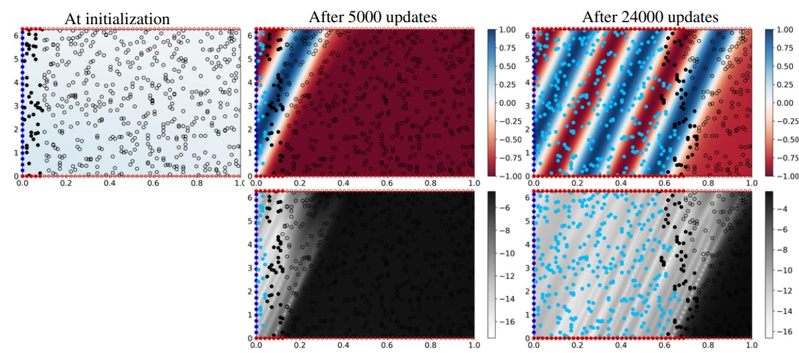
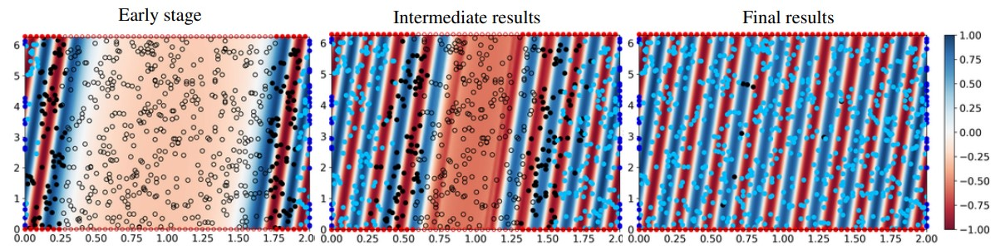

## Improved Training of Physics-Informed Neural Networks with Model Ensembles

The repository contains the implementation of the ensemble algorithm for physics-informed neural network (PINNs) training. To improve the training of PINNs we follow the idea of the gradual expansion of the solution interval 
when training PINNs. We propose to train an ensemble of PINNs and use the ensemble agreement (confidence) as the criterion for expanding the solution interval to new areas. In the figure above top row shows the mean prediction across 
the ensemble while the bottom row shows the corresponding variance. In the figure filled circles represent points included in the training loss and the empty circles represent candidate points that are eventually added during training.




The proposed algorithm does not need a pre-defined schedule of interval expansion and it treats time and space equally. Due to the flexibility of the proposed domain expansion, 
our algorithm can easily incorporate measurements in arbitrary locations: the algorithm will propagate the
solution from all the locations where supervision targets are known (see an example below).



The method was evaluated on a set of partial differential equations (PDEs): reaction, reaction-diffusion, convection, diffusion and heat equations. 

### File structure
1. Data: the data used in our experiments are generated from the corresponding PDEs (pde.py file for the implementation) and saved to files available in `data` folder. To generate new data, run `python generate_data.py`. One can plot the generated data by running `python plot_generated_data.py`
2. Main logic of the proposed algorithm is implemented in pinn.py file (the class PINNMultParallel2D). The implementation for the baseline PINN is adopted from one of our closest time-adaptive baselines by [Krishnapriyan et al.](https://github.com/a1k12/characterizing-pinns-failure-modes)

### Requirements
Main libraries versions: 
```
torch==1.13.0
wandb==0.13.4
torchvision==0.14.0
```


### Usage 
We present two versions of the proposed algorithm: with (Pseudo-labels) and without (PINN Ensemble) pseudo-labels included in the loss calculation. The PINN ensemble version is enabled by default. To run the algorithm with pseudo-labels loss, add the flag `--include_pl` to the command.

**PINN Ensemble version**:
```python
python run_job.py --sys reaction --model_type ens --const 5 --n_iter 60 --use_w --no_wandb
```

**Pseudo-labels**
```python
python run_job.py --sys reaction --model_type ens --const 5 --n_iter 60 --use_w --include_pl --no_wandb
```

**Baseline PINN**
```python
python run_job.py --sys reaction --model_type pinn --const 5 --n_iter 60 --no_wandb
```

Tuning with LBFGS optimizer is enabled by adding '--use_two_opt' to the commands. 
For all of the models, we train convection equation with $\beta = 30$ for `n_iter=100` and with
$\beta = 40$ for `n_iter=150`, reaction and reaction-diffusion (rd) equations are trained for `n_iter=60`
updates, diffusion and heat equations with d = 5 and d = 7 for `n_iter=80` updates and with d = 10 for `n_iter=100`.

### Citation

```bibtex 
@article{haitsiukevich2022improved,
  title={Improved training of physics-informed neural networks with model ensembles},
  author={Haitsiukevich, Katsiaryna and Ilin, Alexander},
  journal={arXiv preprint arXiv:2204.05108},
  year={2022}
}
```

